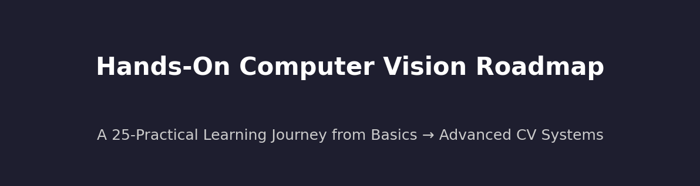

# 🖼️ Hands-On Computer Vision Roadmap  
*A 25-Practical Learning Journey from Basics to Advanced CV Systems*  

[](https://colab.research.google.com)  
  
  
  

---

# 📑 Table of Contents

- [📚 Recommended Prerequisites](#-recommended-prerequisites)
- [🚀 How to Use This Repo](#-how-to-use-this-repo)
- [🗺️ Learning Roadmap - 25 Practicals](#-learning-roadmap---25-practicals)
  - [🗺️ Visual Roadmap](#-visual-roadmap)
  - [Legend](#legend)
  - [Progress Tracker](#progress-tracker)
- [🎯 Learning Outcomes](#-learning-outcomes)
- [🌟 Next Steps After This Roadmap](#-next-steps-after-this-roadmap)

---

## 📚 Recommended Prerequisites

Before starting, students should be comfortable with:

- **Python programming basics** (functions, loops, lists, dictionaries) 🐍  
- **NumPy** for matrix/tensor operations 🔢  
- **Basic Linear Algebra** (vectors, matrices, dot products) ➕  
- **Basic Probability & Statistics** (mean, variance, distributions) 🎲  
- **Machine Learning fundamentals** (train/val/test split, overfitting, gradient descent) 🤖  

👉 If you’re new to these, complete a short **Python + Math for ML refresher** first.

---

## 🚀 How to Use This Repo

This repository is a **hands‑on learning roadmap** for Computer Vision.  

1. **📂 Get the Repo**  
   - Fork or clone: `git clone https://github.com/YOUR_GITHUB_USERNAME/YOUR_REPO_NAME.git`  
   - Or open notebooks directly in **Google Colab** using the badges.

2. **☁️ Run in Google Colab (Recommended)**  
   - Each practical has a **Colab badge** → click it to open in Colab (GPU ready).  

3. **💻 Run Locally (Optional)**  
   - Install Python 3.9+ and [PyTorch](https://pytorch.org/get-started/locally/).  
   - `pip install -r requirements.txt` → `jupyter notebook`

4. **📦 Datasets**  
   - Small datasets auto‑download. Larger ones have links/scripts inside notebooks.

5. **📝 Track Your Progress**  
   - Use the **Progress Tracker** table below (⬜ → ✅).

---

## 🗺️ Learning Roadmap - 25 Practicals

**Overall Estimated Time:** ⏱ ~19–31 hours for all 25 practicals.

**Suggested Weekly Schedule:**  
- 2 practicals/week → ~12 weeks (slower pace)  
- 3 practicals/week → ~8 weeks (balanced)  
- 5 practicals/week → ~5 weeks (intensive)  

### 🗺️ Visual Roadmap

```mermaid
flowchart LR
    A[Foundations<br>(1–6)] --> B[CNN Backbones & Scaling<br>(7–15)]
    B --> C[Transformers<br>(16)]
    C --> D[Detection & Tracking<br>(17–20)]
    D --> E[Segmentation<br>(21–24)]
    E --> F[Multitask & Deployment<br>(25)]
```


| # | Module | Practical | Open in Colab | Topics Covered |
|---:|---|-----------|:-------------:|----------------|
| 1 | Foundations | **Building a Simple Neural Network (No Activation Functions)** | [](https://colab.research.google.com/drive/1jkdGNJ6cDcGEuPZSF7Mdgxh1EZTphUCU?usp=drive_link) | 🧠 Linear layers, forward pass math; 🛠️ PyTorch autograd vs. manual gradients; 📊 Loss curves ⏱ ~45–75 min |
| 2 | Foundations | **Enhancing with Activation Functions** | [](https://colab.research.google.com/drive/1Wotdb8Z_a8MRugs6iCDfmGO6eMqj6mhV?usp=drive_link) | 🧠 Why non-linearity matters; 🛠️ ReLU/Sigmoid/Tanh; 📊 Decision boundaries ⏱ ~45–75 min |
| 3 | Foundations | **Overfitting Prevention** | [](https://colab.research.google.com/github/YOUR_GITHUB_USERNAME/YOUR_REPO_NAME/blob/main/Practical_3_Overfitting_Prevention.ipynb) | 🧠 Bias–variance tradeoff; 🛠️ L2, Dropout, Augmentation; 📊 Learning-curve diagnostics ⏱ ~45–75 min |
| 4 | Foundations | **Transfer Learning (Intro)** | [](https://colab.research.google.com/github/YOUR_GITHUB_USERNAME/YOUR_REPO_NAME/blob/main/Practical_4_Transfer_Learning.ipynb) | 🧠 Pretrained backbones; 🛠️ Freeze layers; 📊 Small-data generalization ⏱ ~45–75 min |
| 5 | Foundations | **Hyperparameter Tuning with Weights & Biases** | [](https://colab.research.google.com/github/YOUR_GITHUB_USERNAME/YOUR_REPO_NAME/blob/main/Practical_5_Hyperparameter_Tuning_W%26B.ipynb) | 🛠️ Experiment tracking; 📊 Grid/Random/Bayes sweeps; 🚀 Best-model selection ⏱ ~45–75 min |
| 6 | Foundations | **Evaluation Metrics** | [](https://colab.research.google.com/github/YOUR_GITHUB_USERNAME/YOUR_REPO_NAME/blob/main/Practical_6_Evaluation_Metrics.ipynb) | 📊 Confusion matrix, Precision/Recall/F1, ROC–AUC vs. PR–AUC; 🧠 Imbalance handling ⏱ ~45–75 min |
| 7 | CNN Backbones & Scaling | **CNN Fundamentals & AlexNet** | [](https://colab.research.google.com/github/YOUR_GITHUB_USERNAME/YOUR_REPO_NAME/blob/main/Practical_7_CNN%20Fundamentals_%26_AlexNet.ipynb) | 🧠 Convolutions, pooling, receptive fields; 🛠️ Implement AlexNet ⏱ ~45–75 min |
| 8 | CNN Backbones & Scaling | **Deep Dive into VGG-16** | [](https://colab.research.google.com/github/YOUR_GITHUB_USERNAME/YOUR_REPO_NAME/blob/main/Practical_8_Deep_Dive_into_VGG-16.ipynb) | 🧠 Stacked 3×3 convs; 🛠️ Feature extraction; 📊 Parameter counts ⏱ ~45–75 min |
| 9 | CNN Backbones & Scaling | **GoogLeNet (InceptionV1)** | [](https://colab.research.google.com/github/YOUR_GITHUB_USERNAME/YOUR_REPO_NAME/blob/main/Practical_9_GoogLeNet_InceptionV1.ipynb) | 🧠 Inception multi-scale design; 🛠️ 1×1 bottlenecks; 📊 Aux classifiers ⏱ ~45–75 min |
| 10 | CNN Backbones & Scaling | **SqueezeNet & Fire Modules** | [](https://colab.research.google.com/github/YOUR_GITHUB_USERNAME/YOUR_REPO_NAME/blob/main/Practical_10_SqueezeNet_Fire_Modules.ipynb) | 🧠 Parameter-efficient design; 🛠️ Squeeze/Expand blocks; 📊 Model size vs. accuracy ⏱ ~45–75 min |
| 11 | CNN Backbones & Scaling | **ResNet — Residual Learning** | [](https://colab.research.google.com/github/YOUR_GITHUB_USERNAME/YOUR_REPO_NAME/blob/main/Practical_11_ResNet_Residual_Learning.ipynb) | 🧠 Vanishing-gradient fix; 🛠️ Residual blocks; 📊 Depth scaling ⏱ ~45–75 min |
| 12 | CNN Backbones & Scaling | **MobileNet — Depthwise Separable Convolutions** | [](https://colab.research.google.com/github/YOUR_GITHUB_USERNAME/YOUR_REPO_NAME/blob/main/Practical_12_MobileNet_Depthwise_Separable_Convolutions.ipynb) | 🧠 Depthwise + pointwise convs; 🛠️ Width/resolution multipliers; 🚀 Mobile deployment ⏱ ~45–75 min |
| 13 | CNN Backbones & Scaling | **DenseNet — Densely Connected Networks** | [](https://colab.research.google.com/github/YOUR_GITHUB_USERNAME/YOUR_REPO_NAME/blob/main/Practical_13_DenseNet_Densely_Connected_Networks.ipynb) | 🧠 Dense connectivity; 🛠️ Transition layers; 📊 Growth/compression ⏱ ~45–75 min |
| 14 | CNN Backbones & Scaling | **EfficientNet — Compound Scaling** | [](https://colab.research.google.com/github/YOUR_GITHUB_USERNAME/YOUR_REPO_NAME/blob/main/Practical_14_EfficientNet_Compound_Scaling.ipynb) | 🧠 Scaling law; 🛠️ MBConv blocks; 📊 Model family trade-offs ⏱ ~45–75 min |
| 15 | CNN Backbones & Scaling | **Transfer Learning: Freeze vs. Fine-Tune** | [](https://colab.research.google.com/github/YOUR_GITHUB_USERNAME/YOUR_REPO_NAME/blob/main/Practical_15_Transfer_Learning_Freeze_vs_FineTune.ipynb) | 🧠 When to freeze; 🛠️ Layer-wise tuning; 📊 Forgetting diagnostics ⏱ ~45–75 min |
| 16 | Transformers | **Vision Transformers (ViT) — Flowers** | [](https://colab.research.google.com/github/YOUR_GITHUB_USERNAME/YOUR_REPO_NAME/blob/main/Practical_16_Vision_Transformers_ViT_Flowers.ipynb) | 🧠 Patch embeddings, MHSA; 🛠️ Fine-tuning; 📊 Training on small datasets ⏱ ~45–75 min |
| 17 | Detection & Tracking | **From R-CNN to Mask R-CNN** | [](https://colab.research.google.com/github/YOUR_GITHUB_USERNAME/YOUR_REPO_NAME/blob/main/Practical_17_R-CNN_to_Mask-RCNN.ipynb) | 🧠 Two-stage detection; 🛠️ ROI Align; 📊 mAP/IoU ⏱ ~45–75 min |
| 18 | Detection & Tracking | **YOLO Object Detection** | [](https://colab.research.google.com/github/YOUR_GITHUB_USERNAME/YOUR_REPO_NAME/blob/main/Practical_18_YOLO_Object_Detection.ipynb) | 🧠 One-stage pipeline; 🛠️ Anchors/NMS; 📊 Confidence thresholds ⏱ ~45–75 min |
| 19 | Detection & Tracking | **Classical Object Tracking & Counting** | [](https://colab.research.google.com/github/YOUR_GITHUB_USERNAME/YOUR_REPO_NAME/blob/main/Practical_19_Object_Tracking_and_Counting_Classical_CV.ipynb) | 🧠 Optical flow & background subtraction; 🛠️ Tracking-by-detection; 📊 Counting logic ⏱ ~45–75 min |
| 20 | Detection & Tracking | **Multi-Object Tracking (YOLOv11 + DeepSORT + ByteTrack)** | [](https://colab.research.google.com/github/YOUR_GITHUB_USERNAME/YOUR_REPO_NAME/blob/main/Practical_20_MOT_YOLOv11_DeepSORT_ByteTrack.ipynb) | 🧠 Detection-to-tracking integration; 🛠️ Kalman + Hungarian; 📊 MOTA/IDF1 ⏱ ~45–75 min |
| 21 | Segmentation | **Classic Image Segmentation** | [](https://colab.research.google.com/github/YOUR_GITHUB_USERNAME/YOUR_REPO_NAME/blob/main/Practical_21_Classic_Image_Segmentation.ipynb) | 🧠 Thresholding, Watershed; 🛠️ Morph ops; 📊 Region evaluation ⏱ ~45–75 min |
| 22 | Segmentation | **Binary Segmentation with U-Net** | [](https://colab.research.google.com/github/YOUR_GITHUB_USERNAME/YOUR_REPO_NAME/blob/main/Practical_22_Binary_Segmentation_UNet.ipynb) | 🧠 Encoder–decoder design; 🛠️ Skip connections; 📊 Dice/BCE losses ⏱ ~45–75 min |
| 23 | Segmentation | **Multi-Class Segmentation** | [](https://colab.research.google.com/github/YOUR_GITHUB_USERNAME/YOUR_REPO_NAME/blob/main/Practical_23_MultiClass_Segmentation.ipynb) | 🧠 Per-class masks; 🛠️ Weighted CE; 📊 mIoU/Mean-Dice ⏱ ~45–75 min |
| 24 | Segmentation | **U-Net Family Comparative Study** | [](https://colab.research.google.com/github/YOUR_GITHUB_USERNAME/YOUR_REPO_NAME/blob/main/Practical_24_UNet_Family_Comparative.ipynb) | 🧠 U-Net++, Attention gates; 📊 Ablation studies; 🚀 Lightweight deployment ⏱ ~45–75 min |
| 25 | Multitask & Deployment | **CV Studio — Multitask Learning** | [](https://colab.research.google.com/github/YOUR_GITHUB_USERNAME/YOUR_REPO_NAME/blob/main/Practical_25_CV_Studio_Multitask.ipynb) | 🧠 Shared encoder theory; 🛠️ Multi-head implementation; 📊 Loss balancing; 🚀 Deployment tips ⏱ ~45–75 min |

<details>
<summary><strong>Foundations</strong> (6 practicals • ~6.0–9.0h) — <em>Prereqs:</em> Basic Python & NumPy; beginner PyTorch.</summary>

| # | Practical | Open in Colab | Topics Covered |
|---:|-----------|:-------------:|----------------|
| 1 | **Building a Simple Neural Network (No Activation Functions)** | [](https://colab.research.google.com/drive/1jkdGNJ6cDcGEuPZSF7Mdgxh1EZTphUCU?usp=drive_link) | 🧠 Linear layers, forward pass math; 🛠️ PyTorch autograd vs. manual gradients; 📊 Loss curves ⏱ ~45–75 min |
| 2 | **Enhancing with Activation Functions** | [](https://colab.research.google.com/drive/1Wotdb8Z_a8MRugs6iCDfmGO6eMqj6mhV?usp=drive_link) | 🧠 Why non-linearity matters; 🛠️ ReLU/Sigmoid/Tanh; 📊 Decision boundaries ⏱ ~45–75 min |
| 3 | **Overfitting Prevention** | [](https://colab.research.google.com/github/YOUR_GITHUB_USERNAME/YOUR_REPO_NAME/blob/main/Practical_3_Overfitting_Prevention.ipynb) | 🧠 Bias–variance tradeoff; 🛠️ L2, Dropout, Augmentation; 📊 Learning-curve diagnostics ⏱ ~45–75 min |
| 4 | **Transfer Learning (Intro)** | [](https://colab.research.google.com/github/YOUR_GITHUB_USERNAME/YOUR_REPO_NAME/blob/main/Practical_4_Transfer_Learning.ipynb) | 🧠 Pretrained backbones; 🛠️ Freeze layers; 📊 Small-data generalization ⏱ ~45–75 min |
| 5 | **Hyperparameter Tuning with Weights & Biases** | [](https://colab.research.google.com/github/YOUR_GITHUB_USERNAME/YOUR_REPO_NAME/blob/main/Practical_5_Hyperparameter_Tuning_W%26B.ipynb) | 🛠️ Experiment tracking; 📊 Grid/Random/Bayes sweeps; 🚀 Best-model selection ⏱ ~45–75 min |
| 6 | **Evaluation Metrics** | [](https://colab.research.google.com/github/YOUR_GITHUB_USERNAME/YOUR_REPO_NAME/blob/main/Practical_6_Evaluation_Metrics.ipynb) | 📊 Confusion matrix, Precision/Recall/F1, ROC–AUC vs. PR–AUC; 🧠 Imbalance handling ⏱ ~45–75 min |

</details>

<details>
<summary><strong>CNN Backbones & Scaling</strong> (9 practicals • ~9.0–13.5h) — <em>Prereqs:</em> Foundations module (tensor ops, training loop).</summary>

| # | Practical | Open in Colab | Topics Covered |
|---:|-----------|:-------------:|----------------|
| 7 | **CNN Fundamentals & AlexNet** | [](https://colab.research.google.com/github/YOUR_GITHUB_USERNAME/YOUR_REPO_NAME/blob/main/Practical_7_CNN%20Fundamentals_%26_AlexNet.ipynb) | 🧠 Convolutions, pooling, receptive fields; 🛠️ Implement AlexNet ⏱ ~45–75 min |
| 8 | **Deep Dive into VGG-16** | [](https://colab.research.google.com/github/YOUR_GITHUB_USERNAME/YOUR_REPO_NAME/blob/main/Practical_8_Deep_Dive_into_VGG-16.ipynb) | 🧠 Stacked 3×3 convs; 🛠️ Feature extraction; 📊 Parameter counts ⏱ ~45–75 min |
| 9 | **GoogLeNet (InceptionV1)** | [](https://colab.research.google.com/github/YOUR_GITHUB_USERNAME/YOUR_REPO_NAME/blob/main/Practical_9_GoogLeNet_InceptionV1.ipynb) | 🧠 Inception multi-scale design; 🛠️ 1×1 bottlenecks; 📊 Aux classifiers ⏱ ~45–75 min |
| 10 | **SqueezeNet & Fire Modules** | [](https://colab.research.google.com/github/YOUR_GITHUB_USERNAME/YOUR_REPO_NAME/blob/main/Practical_10_SqueezeNet_Fire_Modules.ipynb) | 🧠 Parameter-efficient design; 🛠️ Squeeze/Expand blocks; 📊 Model size vs. accuracy ⏱ ~45–75 min |
| 11 | **ResNet — Residual Learning** | [](https://colab.research.google.com/github/YOUR_GITHUB_USERNAME/YOUR_REPO_NAME/blob/main/Practical_11_ResNet_Residual_Learning.ipynb) | 🧠 Vanishing-gradient fix; 🛠️ Residual blocks; 📊 Depth scaling ⏱ ~45–75 min |
| 12 | **MobileNet — Depthwise Separable Convolutions** | [](https://colab.research.google.com/github/YOUR_GITHUB_USERNAME/YOUR_REPO_NAME/blob/main/Practical_12_MobileNet_Depthwise_Separable_Convolutions.ipynb) | 🧠 Depthwise + pointwise convs; 🛠️ Width/resolution multipliers; 🚀 Mobile deployment ⏱ ~45–75 min |
| 13 | **DenseNet — Densely Connected Networks** | [](https://colab.research.google.com/github/YOUR_GITHUB_USERNAME/YOUR_REPO_NAME/blob/main/Practical_13_DenseNet_Densely_Connected_Networks.ipynb) | 🧠 Dense connectivity; 🛠️ Transition layers; 📊 Growth/compression ⏱ ~45–75 min |
| 14 | **EfficientNet — Compound Scaling** | [](https://colab.research.google.com/github/YOUR_GITHUB_USERNAME/YOUR_REPO_NAME/blob/main/Practical_14_EfficientNet_Compound_Scaling.ipynb) | 🧠 Scaling law; 🛠️ MBConv blocks; 📊 Model family trade-offs ⏱ ~45–75 min |
| 15 | **Transfer Learning: Freeze vs. Fine-Tune** | [](https://colab.research.google.com/github/YOUR_GITHUB_USERNAME/YOUR_REPO_NAME/blob/main/Practical_15_Transfer_Learning_Freeze_vs_FineTune.ipynb) | 🧠 When to freeze; 🛠️ Layer-wise tuning; 📊 Forgetting diagnostics ⏱ ~45–75 min |

</details>

<details>
<summary><strong>Transformers</strong> (1 practicals • ~1.0–1.5h) — <em>Prereqs:</em> Foundations + familiarity with CNN features.</summary>

| # | Practical | Open in Colab | Topics Covered |
|---:|-----------|:-------------:|----------------|
| 16 | **Vision Transformers (ViT) — Flowers** | [](https://colab.research.google.com/github/YOUR_GITHUB_USERNAME/YOUR_REPO_NAME/blob/main/Practical_16_Vision_Transformers_ViT_Flowers.ipynb) | 🧠 Patch embeddings, MHSA; 🛠️ Fine-tuning; 📊 Training on small datasets ⏱ ~45–75 min |

</details>

<details>
<summary><strong>Detection & Tracking</strong> (4 practicals • ~4.0–6.0h) — <em>Prereqs:</em> CNN Backbones; evaluation metrics (precision/recall, IoU).</summary>

| # | Practical | Open in Colab | Topics Covered |
|---:|-----------|:-------------:|----------------|
| 17 | **From R-CNN to Mask R-CNN** | [](https://colab.research.google.com/github/YOUR_GITHUB_USERNAME/YOUR_REPO_NAME/blob/main/Practical_17_R-CNN_to_Mask-RCNN.ipynb) | 🧠 Two-stage detection; 🛠️ ROI Align; 📊 mAP/IoU ⏱ ~45–75 min |
| 18 | **YOLO Object Detection** | [](https://colab.research.google.com/github/YOUR_GITHUB_USERNAME/YOUR_REPO_NAME/blob/main/Practical_18_YOLO_Object_Detection.ipynb) | 🧠 One-stage pipeline; 🛠️ Anchors/NMS; 📊 Confidence thresholds ⏱ ~45–75 min |
| 19 | **Classical Object Tracking & Counting** | [](https://colab.research.google.com/github/YOUR_GITHUB_USERNAME/YOUR_REPO_NAME/blob/main/Practical_19_Object_Tracking_and_Counting_Classical_CV.ipynb) | 🧠 Optical flow & background subtraction; 🛠️ Tracking-by-detection; 📊 Counting logic ⏱ ~45–75 min |
| 20 | **Multi-Object Tracking (YOLOv11 + DeepSORT + ByteTrack)** | [](https://colab.research.google.com/github/YOUR_GITHUB_USERNAME/YOUR_REPO_NAME/blob/main/Practical_20_MOT_YOLOv11_DeepSORT_ByteTrack.ipynb) | 🧠 Detection-to-tracking integration; 🛠️ Kalman + Hungarian; 📊 MOTA/IDF1 ⏱ ~45–75 min |

</details>

<details>
<summary><strong>Segmentation</strong> (4 practicals • ~4.0–6.0h) — <em>Prereqs:</em> CNN Backbones; data pipelines & augmentations.</summary>

| # | Practical | Open in Colab | Topics Covered |
|---:|-----------|:-------------:|----------------|
| 21 | **Classic Image Segmentation** | [](https://colab.research.google.com/github/YOUR_GITHUB_USERNAME/YOUR_REPO_NAME/blob/main/Practical_21_Classic_Image_Segmentation.ipynb) | 🧠 Thresholding, Watershed; 🛠️ Morph ops; 📊 Region evaluation ⏱ ~45–75 min |
| 22 | **Binary Segmentation with U-Net** | [](https://colab.research.google.com/github/YOUR_GITHUB_USERNAME/YOUR_REPO_NAME/blob/main/Practical_22_Binary_Segmentation_UNet.ipynb) | 🧠 Encoder–decoder design; 🛠️ Skip connections; 📊 Dice/BCE losses ⏱ ~45–75 min |
| 23 | **Multi-Class Segmentation** | [](https://colab.research.google.com/github/YOUR_GITHUB_USERNAME/YOUR_REPO_NAME/blob/main/Practical_23_MultiClass_Segmentation.ipynb) | 🧠 Per-class masks; 🛠️ Weighted CE; 📊 mIoU/Mean-Dice ⏱ ~45–75 min |
| 24 | **U-Net Family Comparative Study** | [](https://colab.research.google.com/github/YOUR_GITHUB_USERNAME/YOUR_REPO_NAME/blob/main/Practical_24_UNet_Family_Comparative.ipynb) | 🧠 U-Net++, Attention gates; 📊 Ablation studies; 🚀 Lightweight deployment ⏱ ~45–75 min |

</details>

<details>
<summary><strong>Multitask & Deployment</strong> (1 practicals • ~1.0–1.5h) — <em>Prereqs:</em> Detection and Segmentation basics; experiment tracking.</summary>

| # | Practical | Open in Colab | Topics Covered |
|---:|-----------|:-------------:|----------------|
| 25 | **CV Studio — Multitask Learning** | [](https://colab.research.google.com/github/YOUR_GITHUB_USERNAME/YOUR_REPO_NAME/blob/main/Practical_25_CV_Studio_Multitask.ipynb) | 🧠 Shared encoder theory; 🛠️ Multi-head implementation; 📊 Loss balancing; 🚀 Deployment tips ⏱ ~45–75 min |

</details>


---

**Legend:**  
🧠 = Theory & Concepts | 🛠️ = Implementation & Coding | 📊 = Metrics & Evaluation | 🚀 = Deployment & Applications

---

**Progress Tracker:**  
Check off each practical as you complete it.

| # | Practical | Done |
|---:|-----------|:----:|
| 1 | Simple NN (No Activations) | ⬜ |
| 2 | Activation Functions | ⬜ |
| 3 | Overfitting Prevention | ⬜ |
| 4 | Transfer Learning (Intro) | ⬜ |
| 5 | Hyperparameter Tuning (W&B) | ⬜ |
| 6 | Evaluation Metrics | ⬜ |
| 7 | CNN & AlexNet | ⬜ |
| 8 | VGG‑16 | ⬜ |
| 9 | GoogLeNet (InceptionV1) | ⬜ |
| 10 | SqueezeNet | ⬜ |
| 11 | ResNet | ⬜ |
| 12 | MobileNet | ⬜ |
| 13 | DenseNet | ⬜ |
| 14 | EfficientNet | ⬜ |
| 15 | Transfer Learning (Freeze vs Fine‑Tune) | ⬜ |
| 16 | Vision Transformers (ViT) | ⬜ |
| 17 | R‑CNN to Mask R‑CNN | ⬜ |
| 18 | YOLO Detection | ⬜ |
| 19 | Classical Tracking | ⬜ |
| 20 | MOT (YOLOv11+DeepSORT+ByteTrack) | ⬜ |
| 21 | Classic Segmentation | ⬜ |
| 22 | Binary Segmentation (U‑Net) | ⬜ |
| 23 | Multi‑Class Segmentation | ⬜ |
| 24 | U‑Net Family Comparative | ⬜ |
| 25 | CV Studio Multitask | ⬜ |

---

## 🎯 Learning Outcomes

By the end of this roadmap, you will be able to:

### 🧱 Foundations (1–6)
- Explain tensors, linear layers, forward/backward pass.  
- Use **activation functions** and reason about vanishing gradients.  
- Diagnose **overfitting**; apply L2, **Dropout**, early stopping, **augmentation**.  
- Apply **transfer learning** (freeze vs. fine‑tune).  
- Run **hyperparameter sweeps** with **W&B**.  
- Interpret **metrics** (Accuracy, Precision, Recall, F1, AUC).  

### 🧪 CNN Backbones & Scaling (7–15)
- Understand classic CNNs (**AlexNet → EfficientNet**).  
- Compare **params, FLOPs, accuracy vs. latency**.  
- Use **residual, dense, depthwise, inception** blocks.  
- Apply **scaling strategies** (width, depth, resolution).  

### 🧭 Transformers (16)
- Explain **ViT concepts** (patches, MHSA, encodings).  
- Compare CNNs vs. ViTs for data size and compute.  

### 🎯 Detection & Tracking (17–20)
- Implement **two‑stage vs. one‑stage detection**.  
- Evaluate with **mAP/IoU**.  
- Build tracking with **Kalman, Hungarian, ReID**.  
- Assess with **MOTA/IDF1**.  

### 🧩 Segmentation (21–24)
- Apply **classic segmentation** (thresholding, Watershed, morphology).  
- Train **U‑Net** (binary); extend to **multi‑class** (mIoU, Dice).  
- Compare **U‑Net variants** with ablations.  

### 🧰 Multitask & Deployment (25)
- Design **multi‑head** CV systems; balance losses; plan **deployment**.

### 📈 Professional Skills
- Keep reproducible notebooks; log experiments; write **model cards**; plan study schedules.

---


## 🌟 Next Steps After This Roadmap

1. **📖 Research** — AlexNet, ResNet, U‑Net, ViT, YOLO; diffusion, CLIP/BLIP.  
2. **🏆 Competitions** — [Kaggle](https://www.kaggle.com/competitions); hackathons.  
3. **🛠️ Projects** — traffic/retail detection, medical segmentation, multimodal CV+NLP.  
4. **📦 Deployment** — quantization/pruning; ONNX/TensorRT; mobile; Docker.  
5. **🎓 Studies** — advanced courses; research internships; open‑source.

---
